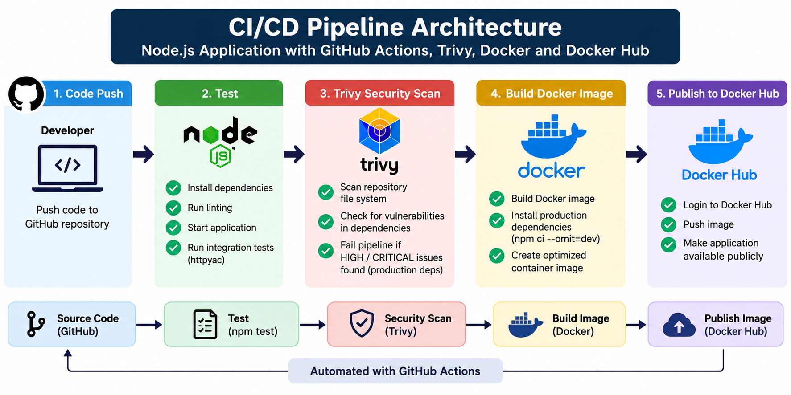
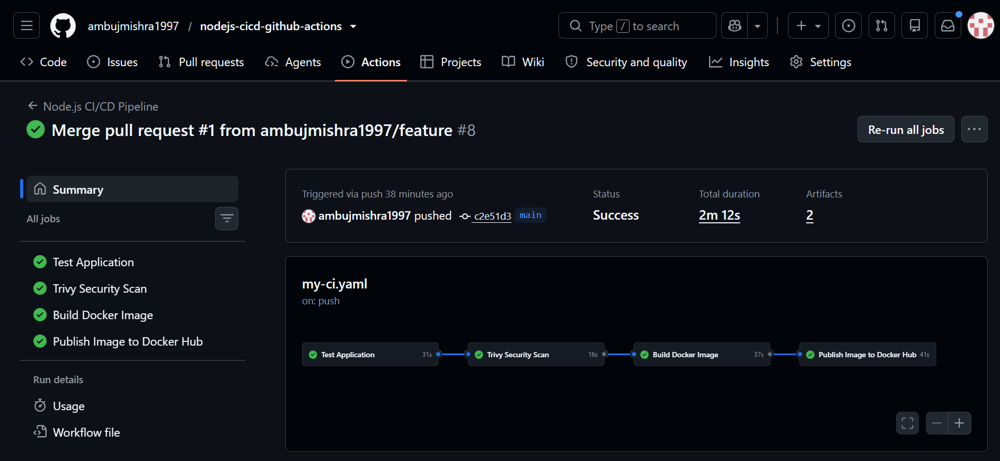
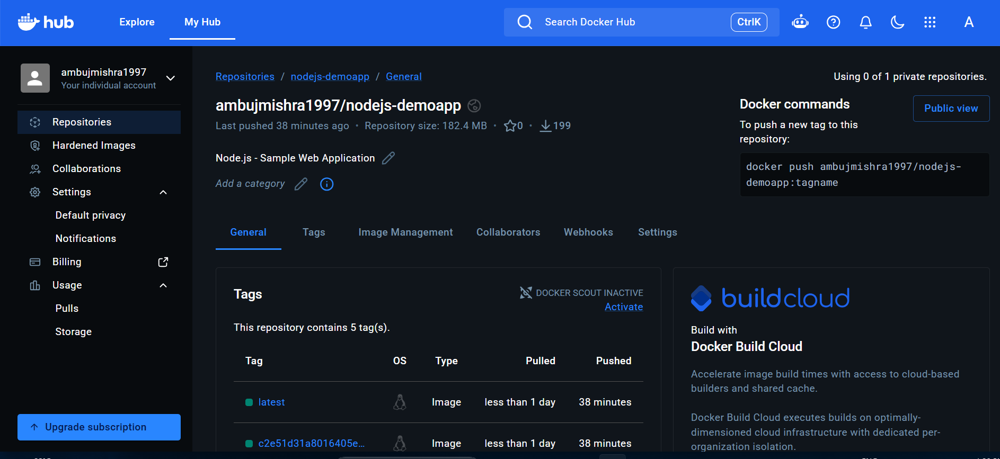

# Node.js DevSecOps CI/CD Pipeline with GitHub Actions

A hands-on DevOps/DevSecOps project that implements a multi-stage CI/CD pipeline for a **Node.js web application** using **GitHub Actions, Docker, Docker Hub, and Trivy**.

<p align="center">
  
</p>

---

The application source is based on the open-source project **benc-uk/nodejs-demoapp**. My work in this repository focuses on the DevOps automation around the application: CI/CD workflow design, testing, security scanning, Docker packaging, artifact transfer, registry publishing, secrets, and documentation.

---

## Project Overview

The pipeline is designed around clear quality and security gates:

```text
Test
  ↓
Trivy Repository / Dependency Security Scan
  ↓
Build Docker Image
  ↓
Publish to Docker Hub
```

A later stage runs only when the previous required stage succeeds. A failed test or failed security gate prevents the Docker image from being published.

For this Node.js application there is no Maven-style `.jar` or `.war` artifact. The **Docker image is the deployable artifact**.

---

## What This Project Demonstrates

- Node.js dependency installation with `npm ci`
- Linting and integration testing
- Application readiness checking before HTTP tests
- Multi-job GitHub Actions workflows
- Job dependencies using `needs`
- Trivy repository/dependency vulnerability scanning
- Security gating before Docker image creation
- Docker image creation with a custom Dockerfile
- Docker image transfer between isolated GitHub Actions runners
- Docker Hub authentication using GitHub Secrets
- Docker image tagging and publishing
- Dependency vulnerability remediation and re-validation
- Git-based traceability between source code and container images

---

# CI/CD Architecture

```text
Developer
   │
   │ git push / pull request
   ▼
GitHub Repository
   │
   ▼
GitHub Actions
   │
   ├────────────── TEST ──────────────┐
   │  Checkout source                 │
   │  Setup Node.js                   │
   │  npm ci                          │
   │  npm run lint                    │
   │  Start application               │
   │  Wait for localhost:3000         │
   │  npm test                        │
   └───────────────┬──────────────────┘
                   │ PASS
                   ▼
          SECURITY / TRIVY FS SCAN
                   │
                   │ Scan repository and
                   │ npm dependency metadata
                   │
                   │ HIGH / CRITICAL gate
                   ▼
                BUILD
                   │
                   │ docker build
                   │ docker save
                   │ upload image artifact
                   ▼
                PUBLISH
                   │
                   │ download artifact
                   │ docker load
                   │ Docker Hub login
                   │ tag + push
                   ▼
              Docker Hub
```

---

# Pipeline Dependency Flow

The workflow uses GitHub Actions job dependencies so later stages cannot continue when an earlier quality or security gate fails.

```text
Test ✅
   ↓
Security Scan ✅
   ↓
Build ✅
   ↓
Publish ✅
```

Example failure behavior:

```text
Test ✅
   ↓
Security Scan ❌
   ↓
Build skipped
   ↓
Publish skipped
```

This is the key DevSecOps improvement in the project: **security is part of the delivery workflow instead of being treated as a separate manual activity**.

---

# Repository Structure

```text
.
├── .github/
│   └── workflows/
│       └── my-ci.yaml
│
├── docs/
│   └── images/
│       ├── pipeline-success.png
│       ├── trivy-security-scan.png
│       └── dockerhub-image.png
│
├── src/
│   ├── public/
│   ├── routes/
│   ├── tests/
│   ├── todo/
│   ├── views/
│   ├── .env.sample
│   ├── eslint.config.mjs
│   ├── graph.mjs
│   ├── package.json
│   ├── package-lock.json
│   └── server.mjs
│
├── Dockerfile
├── .dockerignore
├── .gitignore
├── .prettierrc.yaml
└── README.md
```

> The `docs/images` filenames are suggested evidence paths. Add only screenshots that actually exist in the repository.

---

# Tech Stack

- **Node.js**
- **npm**
- **Git / GitHub**
- **GitHub Actions**
- **Docker**
- **Docker Hub**
- **Trivy**
- **Linux GitHub-hosted runners**
- **YAML**

---

# Workflow Breakdown

## 1. Test Job

The Test job validates the application before security scanning or Docker packaging.

```text
Checkout Source Code
        ↓
Setup Node.js
        ↓
npm ci
        ↓
npm run lint
        ↓
npm start
        ↓
Readiness Check
        ↓
npm test
```

`npm ci` installs dependencies using the exact versions recorded in `package-lock.json`, making CI runs clean and reproducible.

The application must be running before the HTTP integration tests execute:

```text
npm start
   ↓
Wait until port 3000 responds
   ↓
npm test
```

This avoids false failures caused by tests starting before the application is ready.

---

## 2. Security Scan Job

The security stage runs after the Test job succeeds.

```text
Test
  ↓
Trivy Filesystem / Repository Scan
  ↓
Security Gate
```

Trivy inspects repository dependency metadata such as:

```text
src/package-lock.json
```

The purpose of this stage is to detect known vulnerabilities in application dependencies **before the Docker image is built and published**.

### Important distinction

The Trivy repository scan is executed **by the CI/CD pipeline**, but findings in `package-lock.json` are vulnerabilities in the application's npm dependency tree. That is different from saying that the GitHub Actions YAML itself is vulnerable.

---

## Dependency Vulnerability Remediation

The project also demonstrates the remediation loop that follows a failed security scan:

```text
Trivy detects vulnerability
          ↓
Identify affected package
          ↓
Identify direct / transitive parent
          ↓
Upgrade dependency
          ↓
Update package-lock.json
          ↓
Run application tests
          ↓
Run security scan again
```

Useful local checks:

```bash
npm audit
npm audit --omit=dev
npm outdated
npm ls <package-name>
```

Production dependencies can be checked separately with:

```bash
npm audit --omit=dev
```

### Why not blindly use `npm audit fix --force`?

`--force` can introduce major-version changes. A security fix therefore needs regression testing:

```text
Dependency change
      ↓
Lint
      ↓
Application startup
      ↓
Integration tests
      ↓
Security rescan
```

A vulnerability is not fully remediated for delivery purposes until the application still works and the security gate passes.

---

## 3. Build Job

The Docker image is built only after the required validation and security jobs succeed.

```text
Checkout Source Code
        ↓
docker build
        ↓
Docker Image
        ↓
docker save
        ↓
nodejs-demoapp.tar
        ↓
Upload GitHub Artifact
```

A commit-based image tag can be used for traceability:

```text
nodejs-demoapp:<commit-sha>
```

---

## 4. Publish Job

The Publish job receives the Docker image produced by the Build job.

```text
Download Artifact
       ↓
docker load
       ↓
Docker Hub Login
       ↓
Tag Image
       ↓
docker push
```

The image is not rebuilt in the Publish job. The same image produced during Build is the image that is sent to the registry.

---

# Why the Docker Image Is Passed as an Artifact

GitHub Actions jobs run on isolated, temporary runners.

```text
Test Job       → Runner 1
Security Job   → Runner 2
Build Job      → Runner 3
Publish Job    → Runner 4
```

A Docker image created on one runner does not automatically exist on another runner, so it must be transferred explicitly:

```text
docker build
     ↓
docker save
     ↓
nodejs-demoapp.tar
     ↓
Upload Artifact
     ↓
Download Artifact
     ↓
docker load
     ↓
docker push
```

---

# Dockerfile

```dockerfile
FROM node:24-alpine

WORKDIR /app

COPY src/package*.json ./

RUN npm ci --omit=dev

COPY src/ .

ENV NODE_ENV=production

EXPOSE 3000

USER node

CMD ["npm", "start"]
```

Important choices:

- `node:24-alpine` keeps the runtime image relatively small
- package files are copied first to improve layer reuse
- `npm ci --omit=dev` installs production dependencies only
- `USER node` avoids running the application as root
- port `3000` is documented with `EXPOSE`

---

# Local Development and Validation

From the application directory:

```bash
cd src
npm ci
```

Start the application:

```bash
npm start
```

Open:

```text
http://localhost:3000
```

Run tests from another terminal while the application is running:

```bash
npm test
```

Run linting:

```bash
npm run lint
```

Check production dependency vulnerabilities:

```bash
npm audit --omit=dev
```

---

# Docker Usage

Build locally from the repository root:

```bash
docker build -t nodejs-demoapp:local .
```

Run locally:

```bash
docker run -d \
  -p 3000:3000 \
  --name nodejs-demoapp \
  nodejs-demoapp:local
```

---

# Docker Hub

Docker Hub image:

```text
ambujmishra1997/nodejs-demoapp
```

Pull:

```bash
docker pull ambujmishra1997/nodejs-demoapp:latest
```

Run:

```bash
docker run -d \
  -p 3000:3000 \
  --name nodejs-demoapp \
  ambujmishra1997/nodejs-demoapp:latest
```

---

# GitHub Secrets

Docker Hub credentials are stored as GitHub repository secrets instead of being hard-coded in the workflow.

```text
DOCKERHUB_USERNAME
DOCKERHUB_TOKEN
```

Never commit Docker Hub passwords or access tokens to the repository.

---

# Security Principles Practiced

```text
Shift security left
        ↓
Scan before packaging
        ↓
Fail on unacceptable vulnerabilities
        ↓
Remediate dependencies
        ↓
Regression test changes
        ↓
Rescan before delivery
```

The current repository scan focuses on application dependency metadata. A container-image scan is a planned extension so the exact deployable artifact can also be checked before publishing.

---

# What I Learned

- Designing multi-job CI/CD pipelines with clear responsibilities
- Using GitHub Actions `needs` as quality and security gates
- Understanding ephemeral GitHub-hosted runners
- Passing Docker images between jobs using artifacts
- Running readiness checks before integration tests
- Distinguishing direct and transitive npm dependencies
- Integrating vulnerability scanning into CI/CD
- Remediating dependency vulnerabilities without treating forced upgrades as automatically safe
- Using Docker as the deployable artifact for a Node.js application
- Protecting registry credentials with GitHub Secrets
- Using commit-based image tags for traceability

---

# Skills Practiced

- Git and GitHub
- GitHub Actions
- CI/CD pipeline design
- DevSecOps concepts
- Node.js and npm
- `package.json` / `package-lock.json`
- Dependency management
- Vulnerability remediation
- Trivy
- Linting and integration testing
- Application readiness checks
- Dockerfile creation
- Docker image building and tagging
- Docker Hub
- GitHub Secrets
- GitHub Actions artifacts
- Job dependencies
- Commit SHA traceability
- Pipeline troubleshooting

---

# Planned Improvements

- Add a **Trivy Docker image scan** after Build and before Publish
- Retain security scan reports as CI artifacts
- Add SAST using CodeQL, SonarQube, or SonarCloud
- Add secret scanning
- Generate an SBOM for the container image
- Add container image signing / provenance
- Improve Docker build caching
- Add Kubernetes Deployment and Service manifests
- Add Kubernetes readiness and liveness probes
- Automate deployment after image publishing
- Add Prometheus and Grafana monitoring
- Add Terraform-based infrastructure
- Add Dev / Staging / Production environments
- Add a rollback strategy

Target security flow:

```text
Test
 ↓
Trivy Repository Scan
 ↓
Build Docker Image
 ↓
Trivy Image Scan
 ↓
Publish
```

---

# Pipeline Evidence

Recommended screenshot references:

```markdown




```

Only add screenshots that do not expose access tokens, passwords, or other secrets.

---

# Application Source and Attribution

The Node.js application used as the workload for this DevOps project is based on the open-source project:

**benc-uk/nodejs-demoapp**

Original application source:

```text
https://github.com/benc-uk/nodejs-demoapp
```

This repository is used for hands-on DevOps/DevSecOps practice. The work performed in this project includes the GitHub Actions CI/CD workflow, Trivy security integration, Docker packaging, job dependencies, artifact handoff, Docker Hub publishing, secrets configuration, troubleshooting, and documentation.

---

# Author

**Ambuj Mishra**

GitHub: **ambujmishra1997**
